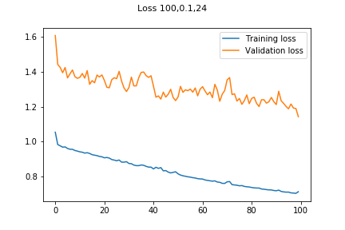
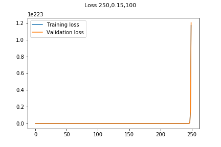

## introDL
The introductory project for the [Deep Learning Foundations Nanodegree program](https://www.udacity.com/course/deep-learning-nanodegree-foundation--nd101), designed to introduce the concepts of Neural Networks. This is technically not my first neural network, but it was still a really fun project, all of which is available in it's final format in [`introductory_neural_network.ipynb`](https://github.com/Vvkmnn/introDL/blob/master/introductory_neural_network.ipynb)

### Setup

This project is relatively minimal, but it requires Python 3 (Preferably as distributed by [Anaconda](https://www.continuum.io/downloads)), as well as a few additional packages that can be installed via:

        conda install numpy matplotlib pandas jupyter notebook

### Results

In this project, we implemented all the steps that go into a very simple neural network (pictured above), including an implementation of **Iterative Gradient Descent** using **Activation Functions**, **Forward Propogation** and **Backward Propogation**

The **final model** yielded a final (MSE) **Training loss of 0.157** and **Validation loss of 0.305** using *2000 epochs*, a *learning rate* of *0.5*, and *35 hidden nodes*, which can be considered effecient performance.  

 

### Testing
100 Iterations|500 iterations|1000 Iterations
-|-|-
||
||

0.01 Learning Rate|0.15 Learning Rate|0.5 Learning Rate
-|-|-
||
||

10 Nodes|100 Nodes|250 Nodes
-|-|-
||
||

